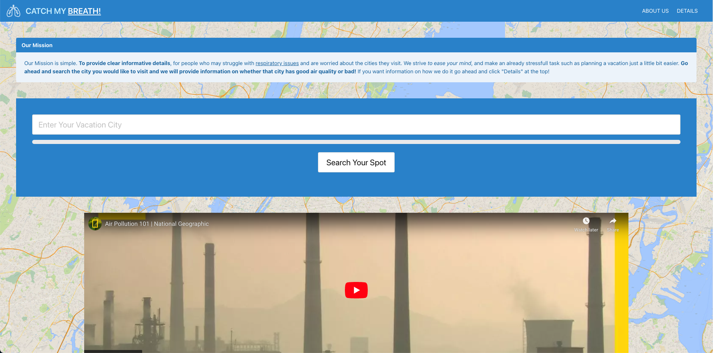

# Catchmybreathe

Welcome to "Catch My Breath", a versitile application that is designed to help anyone find a vacation spot with good air quality to match you health desires.

Whether you have respratory issues, corncerns with respiratory health or you are simply just looking for a place to kick back, relax and breathe in all that nature has to offer. Experience air not as you would in the city, but free of toxic levels of carbon dioxide. 
#### The Purpose
"Catch My Breath" helps you find out just how good the air quality is in your desired vacation spot. How do we do this? Simple!
First search the name of the city that you desire to vacation in in the search box on the home page.

Once a city has been input, a new screen will emerge showing the CO2 levels!

#### How we do It
To get this information, we used two API keys, The first one being "https://api.openweathermap.org/data/2.5/air_pollution?lat=". This one is used to measure the CO2 levels in the air. "https://api.openweathermap.org/geo/1.0/direct?q=" this one is used to grab and display information about the desired vacation destination.

Ultimately, this app is made to help those seek and find the safe and healthly life they deserve. 

Deployment Link: https://willzealot.github.io/Catchmybreathe/

#### links
https://openweathermap.org/api/air-pollution
#### Deployment Link:
 https://willzealot.hithub.io/Catchmybreathe/

### Credits
Noah, Fransisco, Pablo, Harrison, William.

### Liscense
N/A